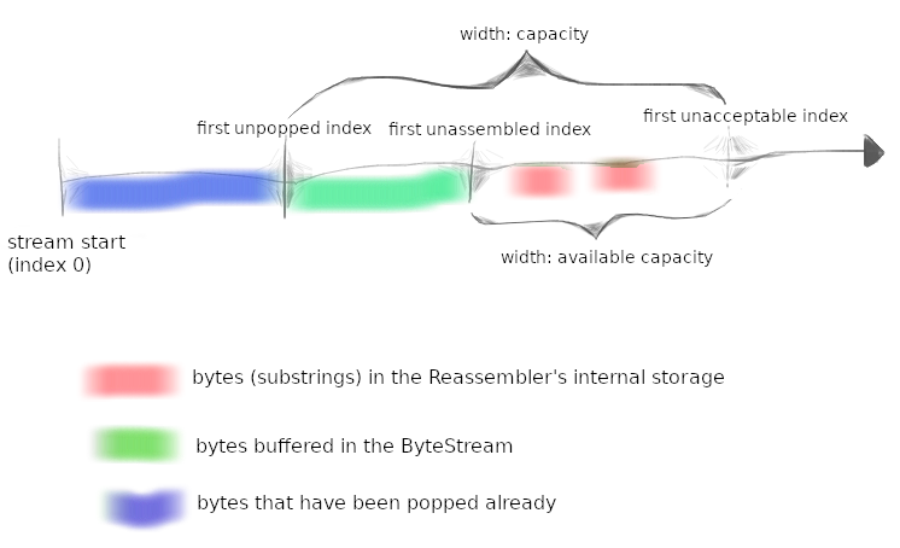

- [Lab 0: networking warmup](#lab-0-networking-warmup)
  - [3 Writing a network program using an OS stream socket](#3-writing-a-network-program-using-an-os-stream-socket)
    - [3.1 Get started](#31-get-started)
    - [3.2 Modern C++: mostly safe but still fast and low-level](#32-modern-c-mostly-safe-but-still-fast-and-low-level)
    - [3.3 Reading the Minnow support code](#33-reading-the-minnow-support-code)
    - [3.4 Writing webget](#34-writing-webget)
  - [4 An in-memory reliable byte stream](#4-an-in-memory-reliable-byte-stream)
- [Lab 1: stitching substrings into a byte stream](#lab-1-stitching-substrings-into-a-byte-stream)
  - [1 Getting started](#1-getting-started)
  - [2 Putting substrings in sequence](#2-putting-substrings-in-sequence)
    - [2.1 What should the Reassembler store internally?](#21-what-should-the-reassembler-store-internally)
    - [2.2 FAQs](#22-faqs)

# Lab 0: networking warmup
## 3 Writing a network program using an OS stream socket
### 3.1 Get started
Fetch the source code: `git clone https://github.com/cs144/minnow ` 

Enter the Lab 0 directory: `cd minnow`

Create a directory to compile the lab software: `cmake -S . -B build`

Compile the source code: `cmake --build build`
### 3.2 Modern C++: mostly safe but still fast and low-level
C++ standard:
1. Use the language documentation at https://en.cppreference.com as a resource. (We’d recommend you avoid cplusplus.com which is more likely to be out-of-date.)
2. Never use `malloc()` or `free()`.
3. Never use `new` or `delete`.
4. Essentially never use raw pointers (`*`), and use "smart" pointers (`unique_ptr` or `shared_ptr`) only when necessary. (You will not need to use these in CS144.)
5. Avoid templates, threads, locks, and virtual functions. (You will not need to use these in CS144.)
6. Avoid C-style strings (`char *str`) or string functions (`strlen(), strcpy()`). These are pretty error-prone. Use a `std::string` instead.
7. Never use C-style casts (e.g., `(FILE *)x`). Use a C++ `static_cast` if you have to (you generally will not need this in CS144).
8. Prefer passing function arguments by const reference (e.g.: `const Address & address`).
9. Make every variable const unless it needs to be mutated.
10. Make every method const unless it needs to mutate the object.
11. Avoid global variables, and give every variable the smallest scope possible.
12. Before handing in an assignment, run `cmake --build build --target tidy` for suggestions on how to improve the code related to C++ programming practices, and `cmake --build build --target format` to format the code consistently

### 3.3 Reading the Minnow support code
Interface: [socket.hh](./minnow/util/socket.hh) and [file_descriptor.hh](./minnow/util/file_descriptor.hh)

### 3.4 Writing webget
To implement: [webget.cc](./minnow/apps/webget.cc), a program to fetch Web pages over the Internet using the operating system’s TCP support and stream-socket abstraction. Use the [TCPSocket](./minnow/util/socket.hh) and [Address](./minnow/util/address.hh) classes.

Hints:
1. Please note that in HTTP, each line must be ended with "\r\n"
2. Don't forget to include the "Connection: close" line in your client's request.
3. Make sure to read and print all the output from the server until the socket reaches "EOF" (end of file) --- a single call to `read` is not enough.

Test: `cmake --build build --target check webget`

## 4 An in-memory reliable byte stream
To implement: [stream.hh](./minnow/src/byte_stream.hh) and [stream.cc](./minnow/src/byte_stream.cc)
Methods to implement:
1. `vector<char>`: time exceeds
2. `deque<char>`: 0.31 Gbit/s
3. `string`: 1.09 Gbit/s
4. `deque<string_view>` and `deque<string>`: 9.79 Gbit/s

`string_view.remove_prefix()` is much faster than `string.substr()` and `deque.erase()`.

About `string_view`:
- [C++17剖析：string_view的实现，以及性能](https://zhuanlan.zhihu.com/p/166359481)
- [C++ 17 std::string_view使用介绍](https://www.cnblogs.com/yangxunwu1992/p/14018837.html)

Notice:
- `c_str()` has the same lifetime as the `string` object.

# Lab 1: stitching substrings into a byte stream
## 1 Getting started
1. Make sure you have committed all your solutions to Checkpoint 0. Please don’t modify any files outside of the *src* directory, or *webget.cc*. You may have trouble merging the Checkpoint 1 starter code otherwise.
2. While inside the repository for the lab assignments, run git fetch to retrieve the most recent version of the lab assignments.
3. Download the starter code for Checkpoint 1 by running `git merge origin/check1-startercode`.
4. Make sure your build system is properly set up: `cmake -S . -B build`
5. Compile the source code: `cmake --build build`

## 2 Putting substrings in sequence
The TCP sender is dividing its byte stream up into short segments (substrings no more than about 1,460 bytes apiece) so that they each fit inside a datagram. But the network might reorder these datagrams, or drop them, or deliver them more than once. The receiver must reassemble the segments into the contiguous stream of bytes that they started out as.
In this lab you’ll write the data structure that will be responsible for this reassembly: *a Reassembler*. It will receive substrings, consisting of a string of bytes, and the index of the first byte of that string within the larger stream. **Each byte of the stream** has its own unique index, starting from zero and counting upwards.
The full (public) interface of the reassembler is described by the *Reassembler* class in the [reassembler.hh](./minnow/src/reassembler.hh) header. Your task is to implement this class. You may add any private members and member functions you desire to the *Reassembler* class, but you cannot change its public interface.

### 2.1 What should the Reassembler store internally?
1. Bytes that are the **next bytes** in the stream. The Reassembler should push these to the Writer as soon as they are known.
2. Bytes that fit within the stream’s available capacity but can’t yet be written, because earlier bytes remain unknown. These should be stored internally in the Reassembler.
3. Bytes that lie beyond the stream’s available capacity. These should be discarded. The Reassembler’s will not store any bytes that can’t be pushed to the ByteStream either immediately, or as soon as earlier bytes become known.

The goal of this behavior is to **limit the amount of memory** used by the Reassembler and ByteStream, no matter how the incoming substrings arrive. We’ve illustrated this in the picture below. The "capacity" is an upper bound on *both*:
1. The number of bytes buffered in the reassembled ByteStream (shown in green), and
2. The number of bytes that can be used by "unassembled" substrings (shown in red)

### 2.2 FAQs
- *What is the index of the first byte in the whole stream?*
Zero.
- *How efficient should my implementation be?*
    The choice of data structure is again important here. Please don’t take this as a challenge to build a grossly space- or time-inefficient data structure—the Reassembler will be the foundation of your TCP implementation. You have a lot of options to choose from. We have provided you with a benchmark; anything greater than 0.1 Gbit/s (100 megabits per second) is acceptable. A top-of-the-line Reassembler will achieve 10 Gbit/s.
- *How should inconsistent substrings be handled?* 
You may assume that they don't exist. That is, you can assume that there is a unique underlying byte-stream, and all substrings are (accurate) slices of it.
- *What may I use?* 
You may use any part of the standard library you find helpful. In particular, we expect you to use at least one data structure.
- *When should bytes be written to the stream?* 
As soon as possible. The only situation in which a byte should not be in the stream is that when there is a byte before it that has not been "pushed" yet.
- *May substrings provided to the `insert()` function overlap?* 
Yes.
- *Will I need to add private members to the Reassembler?* 
Yes. Substrings may arrive in any order, so your data structure will have to "remember" substrings until they’re ready to be put into the stream -- that is, until all indices before them have been written.
- *Is it okay for our re-assembly data structure to store overlapping substrings?* 
No. It is possible to implement an "interface-correct" reassembler that stores overlapping substrings. But allowing the re-assembler to do this undermines the notion of "capacity" as a memory limit. If the caller provides redundant knowledge about the same index, the Reassembler should only store one copy of this information.
