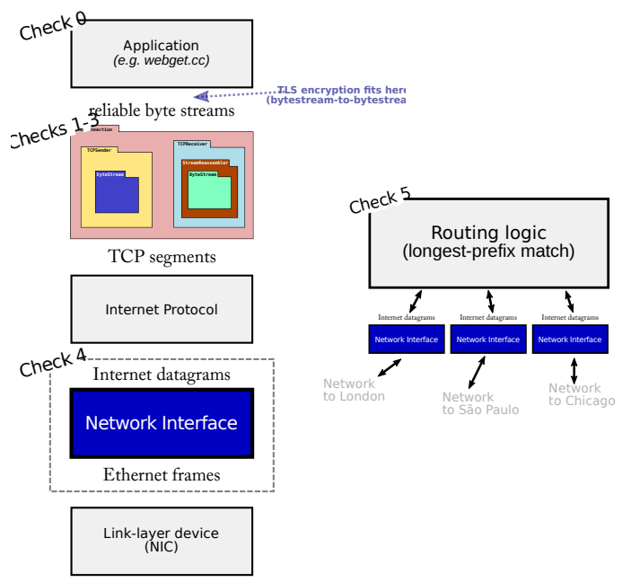
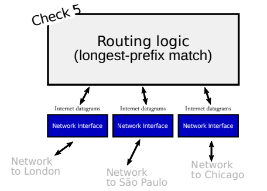
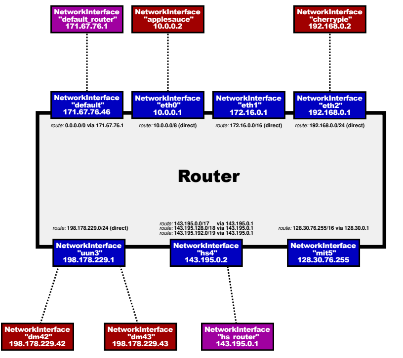

- [Lab 0: networking warmup](#lab-0-networking-warmup)
  - [Writing a network program using an OS stream socket](#writing-a-network-program-using-an-os-stream-socket)
    - [Get started](#get-started)
    - [Modern C++: mostly safe but still fast and low-level](#modern-c-mostly-safe-but-still-fast-and-low-level)
    - [Reading the Minnow support code](#reading-the-minnow-support-code)
    - [Writing webget](#writing-webget)
  - [An in-memory reliable byte stream](#an-in-memory-reliable-byte-stream)
- [Lab 1: stitching substrings into a byte stream](#lab-1-stitching-substrings-into-a-byte-stream)
  - [Getting started](#getting-started)
  - [Putting substrings in sequence](#putting-substrings-in-sequence)
    - [What should the Reassembler store internally?](#what-should-the-reassembler-store-internally)
    - [FAQs](#faqs)
- [Lab 2: the TCP receiver](#lab-2-the-tcp-receiver)
  - [Translating between 64-bit indexes and 32-bit seqnos](#translating-between-64-bit-indexes-and-32-bit-seqnos)
  - [Implementing the TCP receiver](#implementing-the-tcp-receiver)
    - [receive()](#receive)
- [Lab 3: the TCP sender](#lab-3-the-tcp-sender)
  - [How does the TCPSender know if a segment was lost?](#how-does-the-tcpsender-know-if-a-segment-was-lost)
  - [Implementing the TCP sender](#implementing-the-tcp-sender)
  - [FAQs and special cases](#faqs-and-special-cases)
- [Lab 4: down the stack (the network interface)](#lab-4-down-the-stack-the-network-interface)
  - [Overview](#overview)
  - [The Address Resolution Protocol](#the-address-resolution-protocol)
  - [Q \& A](#q--a)
- [Lab 5: building an IP router](#lab-5-building-an-ip-router)
  - [Overview](#overview-1)
  - [Implementing the Router](#implementing-the-router)
  - [Q \& A](#q--a-1)

# Lab 0: networking warmup
## Writing a network program using an OS stream socket
### Get started
Fetch the source code: `git clone https://github.com/cs144/minnow ` 

Enter the Lab 0 directory: `cd minnow`

Create a directory to compile the lab software: `cmake -S . -B build`

Compile the source code: `cmake --build build`
### Modern C++: mostly safe but still fast and low-level
C++ standard:
1. Use the language documentation at https://en.cppreference.com as a resource. (We'd recommend you avoid cplusplus.com which is more likely to be out-of-date.)
2. Never use `malloc()` or `free()`.
3. Never use `new` or `delete`.
4. Essentially never use raw pointers (`*`), and use "smart" pointers (`unique_ptr` or `shared_ptr`) only when necessary. (You will not need to use these in CS144.)
5. Avoid templates, threads, locks, and virtual functions. (You will not need to use these in CS144.)
6. Avoid C-style strings (`char *str`) or string functions (`strlen(), strcpy()`). These are pretty error-prone. Use a `std::string` instead.
7. Never use C-style casts (e.g., `(FILE *)x`). Use a C++ `static_cast` if you have to (you generally will not need this in CS144).
8. Prefer passing function arguments by const reference (e.g.: `const Address & address`).
9. Make every variable const unless it needs to be mutated.
10. Make every method const unless it needs to mutate the object.
11. Avoid global variables, and give every variable the smallest scope possible.
12. Before handing in an assignment, run `cmake --build build --target tidy` for suggestions on how to improve the code related to C++ programming practices, and `cmake --build build --target format` to format the code consistently

### Reading the Minnow support code
Interface: [socket.hh](./minnow/util/socket.hh) and [file_descriptor.hh](./minnow/util/file_descriptor.hh)

### Writing webget
To implement: [webget.cc](./minnow/apps/webget.cc), a program to fetch Web pages over the Internet using the operating system's TCP support and stream-socket abstraction. Use the [TCPSocket](./minnow/util/socket.hh) and [Address](./minnow/util/address.hh) classes.

Hints:
1. Please note that in HTTP, each line must be ended with "\r\n"
2. Don't forget to include the "Connection: close" line in your client's request.
3. Make sure to read and print all the output from the server until the socket reaches "EOF" (end of file) --- a single call to `read` is not enough.

Test: `cmake --build build --target check webget`

## An in-memory reliable byte stream
To implement: [stream.hh](./minnow/src/byte_stream.hh) and [stream.cc](./minnow/src/byte_stream.cc)
Methods to implement:
1. `vector<char>`: time exceeds
2. `deque<char>`: 0.31 Gbit/s
3. `string`: 1.09 Gbit/s
4. `deque<string_view>` and `deque<string>`: 9.79 Gbit/s

`string_view.remove_prefix()` is much faster than `string.substr()` and `deque.erase()`.

About `string_view`:
- [C++17剖析：string_view的实现，以及性能](https://zhuanlan.zhihu.com/p/166359481)
- [C++ 17 std::string_view使用介绍](https://www.cnblogs.com/yangxunwu1992/p/14018837.html)

Notice:
- `c_str()` has the same lifetime as the `string` object.

# Lab 1: stitching substrings into a byte stream
## Getting started
1. Make sure you have committed all your solutions to Checkpoint 0. Please don't modify any files outside of the *src* directory, or *webget.cc*. You may have trouble merging the Checkpoint 1 starter code otherwise.
2. While inside the repository for the lab assignments, run git fetch to retrieve the most recent version of the lab assignments.
3. Download the starter code for Checkpoint 1 by running `git merge origin/check1-startercode`.
4. Make sure your build system is properly set up: `cmake -S . -B build`
5. Compile the source code: `cmake --build build`

## Putting substrings in sequence
The TCP sender is dividing its byte stream up into short segments (substrings no more than about 1,460 bytes apiece) so that they each fit inside a datagram. But the network might reorder these datagrams, or drop them, or deliver them more than once. The receiver must reassemble the segments into the contiguous stream of bytes that they started out as.

In this lab you'll write the data structure that will be responsible for this reassembly: *a Reassembler*. It will receive substrings, consisting of a string of bytes, and the index of the first byte of that string within the larger stream. **Each byte of the stream** has its own unique index, starting from zero and counting upwards.

The full (public) interface of the reassembler is described by the *Reassembler* class in the [reassembler.hh](./minnow/src/reassembler.hh) header. Your task is to implement this class. You may add any private members and member functions you desire to the *Reassembler* class, but you cannot change its public interface.

### What should the Reassembler store internally?
1. Bytes that are the **next bytes** in the stream. The Reassembler should push these to the Writer as soon as they are known.
2. Bytes that fit within the stream's available capacity but can't yet be written, because earlier bytes remain unknown. These should be stored internally in the Reassembler.
3. Bytes that lie beyond the stream's available capacity. These should be discarded. The Reassembler's will not store any bytes that can't be pushed to the ByteStream either immediately, or as soon as earlier bytes become known.

The goal of this behavior is to **limit the amount of memory** used by the Reassembler and ByteStream, no matter how the incoming substrings arrive. We've illustrated this in the picture below. The "capacity" is an upper bound on *both*:
1. The number of bytes buffered in the reassembled ByteStream (shown in green), and
2. The number of bytes that can be used by "unassembled" substrings (shown in red)


### FAQs
- *What is the index of the first byte in the whole stream?*
Zero.
- *How efficient should my implementation be?*
    The choice of data structure is again important here. Please don't take this as a challenge to build a grossly space- or time-inefficient data structure -- the Reassembler will be the foundation of your TCP implementation. You have a lot of options to choose from. We have provided you with a benchmark; anything greater than 0.1 Gbit/s (100 megabits per second) is acceptable. A top-of-the-line Reassembler will achieve 10 Gbit/s.
- *How should inconsistent substrings be handled?* 
You may assume that they don't exist. That is, you can assume that there is a unique underlying byte-stream, and all substrings are (accurate) slices of it.
- *What may I use?* 
You may use any part of the standard library you find helpful. In particular, we expect you to use at least one data structure.
- *When should bytes be written to the stream?* 
As soon as possible. The only situation in which a byte should not be in the stream is that when there is a byte before it that has not been "pushed" yet.
- *May substrings provided to the `insert()` function overlap?* 
Yes.
- *Will I need to add private members to the Reassembler?* 
Yes. Substrings may arrive in any order, so your data structure will have to "remember" substrings until they're ready to be put into the stream -- that is, until all indices before them have been written.
- *Is it okay for our re-assembly data structure to store overlapping substrings?* 
No. It is possible to implement an "interface-correct" reassembler that stores overlapping substrings. But allowing the re-assembler to do this undermines the notion of "capacity" as a memory limit. If the caller provides redundant knowledge about the same index, the Reassembler should only store one copy of this information.

# Lab 2: the TCP receiver
TCP is a protocol that reliably conveys a pair of flow-controlled byte streams (one in each direction) over unreliable datagrams. Two parties, or "peers," participate in the TCP connection, and each peer acts as both "sender" (of its own outgoing byte stream) and "receiver" (of an incoming byte stream) at the same time.

This week, you'll implement the "receiver" part of TCP, responsible for receiving messages from the sender, reassembling the byte stream (including its ending, when that occurs), and determining that messages that should be sent back to the sender for acknowledgment and flow control.

## Translating between 64-bit indexes and 32-bit seqnos
As a warmup, we'll need to implement TCP's way of representing indexes. Last week you created a *Reassembler* that reassembles substrings where each individual byte has a 64-bit **stream index**, with the first byte in the stream always having index zero. A 64-bit index is big enough that we can treat it as **never overflowing**. In the TCP headers, however, space is precious, and each byte's index in the stream is represented not with a 64-bit index but with a 32-bit "sequence number," or "seqno." This adds three complexities:

1. **Your implementation needs to plan for 32-bit integers to wrap around.** Streams in TCP can be arbitrarily long -- there's no limit to the length of a ByteStream that can be sent over TCP. But $2^{32}$ bytes is only 4 GiB, which is not so big. Once a 32-bit sequence number counts up to $2^{32} − 1$, the next byte in the stream will have the sequence number zero.
2. **TCP sequence numbers start at a random value:** To improve robustness and avoid getting confused by old segments belonging to earlier connections between the same endpoints, TCP tries to make sure sequence numbers can't be guessed and are unlikely to repeat. So the sequence numbers for a stream don't start at zero. The first sequence number in the stream is a random 32-bit number called the Initial Sequence Number (ISN). This is the sequence number that represents the "zero point" or the SYN (beginning of stream). The rest of the sequence numbers behave normally after that: the first byte of data will have the sequence number of the ISN+1 (mod $2^{32}$), the second byte will have the ISN+2 (mod $2^{32}$), etc.
3. **The logical beginning and ending each occupy one sequence number:** In addition to ensuring the receipt of all bytes of data, TCP makes sure that the beginning and ending of the stream are received reliably. Thus, in TCP the SYN (beginning-of-stream) and FIN (end-of-stream) control flags are assigned sequence numbers. Each of these occupies one sequence number. (The sequence number occupied by the SYN flag is the ISN.) Each byte of data in the stream also occupies one sequence number. Keep in mind that SYN and FIN aren't part of the stream itself and aren't "bytes" -- they represent the beginning and ending of the byte stream itself.

These sequence numbers (**seqnos**) are transmitted in the header of each TCP segment. (And, again, there are two streams -- one in each direction. Each stream has separate sequence numbers and a different random ISN.) It's also sometimes helpful to talk about the concept of an **"absolute sequence number"** (which always starts at zero and doesn't wrap), and about a **"stream index"** (what you've already been using with your Reassembler: an index for each byte in the stream, starting at zero).

To make these distinctions concrete, consider the byte stream containing just the three-letter string *'cat'*. If the SYN happened to have seqno $2^{32}-2$, then the seqnos, absolute seqnos, and stream indices of each byte are:

| element           | *SYN*      | c          | a | t | *FIN* |
|------------------:|:----------:|:----------:|:-:|:-:|:-----:|
| **seqno**         | $2^{32}-2$ | $2^{32}-1$ | 0 | 1 |  2    |
| **absolute seqno**| 0          | 1          | 2 | 3 |  4    |
| **stream index**  |            | 0          | 1 | 2 |       |


The figure shows the three different types of indexing involved in TCP:

Sequence Numbers | Absolute Sequence Numbers | Stream Indices
----------|----------|:----------
Start at the ISN | Start at 0 | Start at 0
Include SYN/FIN | Include SYN/FIN | Omit SYN/FIN
32 bits, wrapping | 64 bits, non-wrapping | 64 bits, non-wrapping
 "seqno" | "absolute seqno" | "stream index"

Converting between absolute sequence numbers and stream indices is easy enough -- just add or subtract one. Unfortunately, converting between sequence numbers and absolute sequence numbers is a bit harder, and confusing the two can produce tricky bugs. To prevent these bugs systematically, we'll represent sequence numbers with a custom type: *Wrap32*, and write the conversions between it and absolute sequence numbers (represented with *uint64_t*). *Wrap32* is an example of a *wrapper type*: a type that contains an inner type (in this case *uint32_t*) but provides a different set of functions/operators.

We've defined the type for you and provided some helper functions (see [wrapping_integers.hh](src/wrapping_integers.hh)), but you'll implement the conversions in [wrapping_integers.cc](src/wrapping_integers.cc):

1. `static Wrap32 Wrap32::wrap( uint64_t n, Wrap32 zero_point )`
   
   **Convert absolute seqno → seqno.** Given an absolute sequence number (n) and an Initial Sequence Number (zero_point), produce the (relative) sequence number for n.

2. `uint64_t unwrap( Wrap32 zero_point, uint64_t checkpoint ) const`
   
   **Convert seqno → absolute seqno.** Given a sequence number (the Wrap32), the Initial Sequence Number (zero_point), and an absolute checkpoint sequence number, find the corresponding absolute sequence number that is **closest to the checkpoint**.

   Note: A **checkpoint** is required because any given seqno corresponds to many absolute seqnos. E.g. with an ISN of zero, the seqno "17" corresponds to the absolute seqno of 17, but also $2^{32} + 17$, or $2^{33} + 17$, or $2^{33} + 2^{32} + 17$, or $2^{34} + 17$, or $2^{34} + 2^{32} + 17$, etc. The checkpoint helps resolve the ambiguity: it's an absolute seqno that the user of this class knows is "in the ballpark" of the correct answer. In your TCP implementation, you'll use the first unassembled index as the checkpoint.

   **Hint:** *The cleanest/easiest implementation will use the helper functions provided in [wrapping_integers.hh](src/wrapping_integers.hh). The wrap/unwrap operations should preserve offsets -- two seqnos that differ by 17 will correspond to two absolute seqnos that also differ by 17.*
  
   **Hint #2:** *We're expecting one line of code for wrap, and less than 10 lines of code for unwrap. If you find yourself implementing a lot more than this, it might be wise to step back and try to think of a different strategy.*

## Implementing the TCP receiver
Congratulations on getting the wrapping and unwrapping logic right! We'll shake your hand
(or, post-covid, elbow-bump) if this victory happens at the lab session. In the rest of this
lab, you'll be implementing the TCPReceiver. It will (1) receive messages from its peer's
sender and reassemble the ByteStream using a Reassembler, and (2) send messages back to
the peer's sender that contain the acknowledgment number (ackno) and window size. We're
expecting this to take **about 15 lines of code** in total.

First, let's review the format of a TCP "sender message," which contains the information
about the ByteStream. These messages are sent from a TCPSender to its peer's TCPReceiver:

```cpp
/* The TCPSenderMessage contains four fields (minnow/util/tcp_sender_message.hh):
*
* 1) The sequence number (seqno) of the beginning of the segment. If the SYN flag is set,
* this is the sequence number of the SYN flag. Otherwise, it's the sequence number of
* the beginning of the payload.
*
* 2) The SYN flag. If set, it means this segment is the beginning of the byte stream, and
* that the seqno field contains the Initial Sequence Number (ISN) -- the zero point.
*
* 3) The payload: a substring (possibly empty) of the byte stream.
*
* 4) The FIN flag. If set, it means the payload represents the ending of the byte stream. */

struct TCPSenderMessage
{
  Wrap32 seqno { 0 };
  bool SYN { false };
  Buffer payload {};
  bool FIN { false };

  // How many sequence numbers does this segment use?
  size_t sequence_length() const { return SYN + payload.size() + FIN; }
}
```

The TCPReceiver generates its own messages back to the peer's TCPSender:
```cpp
/* The TCPReceiverMessage structure contains (minnow/util/tcp_receiver_message.hh):
*
* 1) The acknowledgment number (ackno): the *next* sequence number needed by the TCP Receiver.
* This is an optional field that is empty if the TCPReceiver hasn't yet received
* the Initial Sequence Number.
*
* 2) The window size. This is the number of sequence numbers that the TCP receiver is interested
* to receive, starting from the ackno if present. The maximum value is 65,535 (UINT16_MAX from
* the <cstdint> header). */

struct TCPReceiverMessage
{
  std::optional<Wrap32> ackno {};
  uint16_t window_size {};
};
```

Your TCPReceiver's job is to receive one of these kinds of messages and send the other:

```cpp
class TCPReceiver
{
public:
  /* The TCPReceiver receives TCPSenderMessages, inserting their payload
  * into the Reassemble at the correct stream index. */
  void receive( TCPSenderMessage message, Reassembler& reassembler, Writer& inbound_stream );

  /* The TCPReceiver sends TCPReceiverMessages back to the TCPSender. */
  TCPReceiverMessage send( const Writer& inbound_stream ) const;
};
```

### receive()
This is method will be called each time a new segment is received from the peer's sender.
This method needs to:

 - **Set the Initial Sequence Number if necessary.** The sequence number of the first-arriving segment that has the SYN flag set is the *initial sequence number*. You'll want
to keep track of that in order to keep converting between 32-bit wrapped seqnos/acknos
and their absolute equivalents. (Note that the SYN flag is just *one* flag in the header.
The same message could also carry data or have the FIN flag set.)

 - **Push any data to the Reassembler.** If the FIN flag is set in a TCPSegment's header,
that means that the last byte of the payload is the last byte of the entire stream.
Remember that the Reassembler expects stream indexes starting at zero; you will have
to unwrap the seqnos to produce these.

# Lab 3: the TCP sender
TCP is a protocol that reliably conveys a pair of flow-controlled byte streams (one in each
direction) over unreliable datagrams. Two party participate in the TCP connection, and
each party is a peer of the other. Each peer acts as both "sender" (of its own outgoing
byte-stream) and "receiver" (of an incoming byte-stream) at the same time.


This week, you'll implement the "sender" part of TCP, responsible for reading from a
ByteStream (created and written to by some sender-side application), and turning the stream
into a sequence of outgoing TCP segments. On the remote side, a TCP receiver
transforms
those segments (those that arrive -- they might not all make it) back into the original byte
stream, and sends acknowledgments and window advertisements back to the sender.

**It will be your TCPSender's responsibility to:**
 - Keep track of the receiver's window (receiving incoming TCPReceiverMessages with
their **ackno**s and **window size**s)
 - Fill the window when possible, by reading from the ByteStream, creating new TCP
segments (including SYN and FIN flags if needed), and sending them. The sender should
keep sending segments until either the window is full or the outbound ByteStream has
nothing more to send.
 - Keep track of which segments have been sent but not yet acknowledged by the receiver -- 
we call these "outstanding" segments
 - Re-send outstanding segments if enough time passes since they were sent, and they
haven't been acknowledged yet

⋆ *Why am I doing this?* The basic principle is to send whatever the receiver will allow
us to send (filling the window), and keep retransmitting until the receiver acknowledges
each segment. This is called "automatic repeat request" (ARQ). The sender divides the
byte stream up into segments and sends them, as much as the receiver's window allows.
Thanks to your work last week, we know that the remote TCP receiver can reconstruct
the byte stream as long as it receives each index-tagged byte at least once -- no matter
the order. The sender's job is to make sure the receiver gets each byte at least once.

## How does the TCPSender know if a segment was lost?

Your TCPSender will be sending a bunch of TCPSenderMessages. Each will contain a (possibly-empty) substring from the outgoing ByteStream, indexed with a sequence number to indicate
its position in the stream, and marked with the SYN flag at the beginning of the stream, and
FIN flag at the end.

In addition to sending those segments, the TCPSender also has to keep track of its outstanding
segments until the sequence numbers they occupy have been fully acknowledged. Periodically,
the owner of the TCPSender will call the TCPSender's tick method, indicating the passage
of time. The TCPSender is responsible for looking through its collection of outstanding
TCPSenderMessages and deciding if the **oldest-sent segment** has been outstanding for too long
without acknowledgment (that is, without all of its sequence numbers being acknowledged).

If so, it needs to be retransmitted (sent again).
Here are the rules for what "outstanding for too long" means. You're going to be implementing this logic, and it's a little detailed, but we don't want you to be worrying about hidden
test cases trying to trip you up or treating this like a word problem on the SAT. We'll give
you some reasonable unit tests this week, and fuller integration tests in Lab 4 once you've
finished the whole TCP implementation. As long as you pass those tests 100% and your
implementation is reasonable, you'll be fine.

⋆ *Why am I doing this?* The overall goal is to let the sender detect when segments
go missing and need to be resent, in a timely manner. The amount of time to wait
before resending is important: you don't want the sender to wait too long to resend a
segment (because that delays the bytes flowing to the receiving application), but you
also don't want it to resend a segment that was going to be acknowledged if the sender
had just waited a little longer -- that wastes the Internet's precious capacity.

1. Every few milliseconds, your TCPSender's tick method will be called with an argument
that tells it how many milliseconds have elapsed since the last time the method was
called. Use this to maintain a notion of the total number of milliseconds the TCPSender
has been alive. **Please don't try to call any "time" or "clock" functions** from
the operating system or CPU -- the tick method is your only access to the passage of
time. That keeps things deterministic and testable.

2. When the TCPSender is constructed, it's given an argument that tells it the "initial value"
of the **retransmission timeout** (RTO). The RTO is the number of milliseconds to
wait before resending an outstanding TCP segment. The value of the RTO will change
over time, but the "initial value" stays the same. The starter code saves the "initial
value" of the RTO in a member variable called _initial_retransmission_timeout.

3. You'll implement the retransmission **timer**: an alarm that can be started at a certain
time, and the alarm goes off (or "expires") once the RTO has elapsed. We emphasize
that this notion of time passing comes from the tick method being called -- not by
getting the actual time of day.
4. Every time a segment containing data (nonzero length in sequence space) is sent
(whether it's the first time or a retransmission), if the timer is not running, **start it running** so that it will **expire after RTO milliseconds (for the current value of RTO)**.
By "expire," we mean that the time will run out a certain number of milliseconds in
the future.
5. When all outstanding data has been acknowledged, **stop** the retransmission timer.
6. If tick is called and the retransmission timer has expired:
     1. Retransmit the earliest (**lowest sequence number**) segment that hasn't been fully
acknowledged by the TCP receiver. You'll need to be storing the outstanding
segments in some internal data structure that makes it possible to do this.
     2. **If the window size is nonzero:**
         1. Keep track of the number of consecutive retransmissions, and increment it
because you just retransmitted something. Your TCPConnection will use this
information to decide if the connection is hopeless (too many consecutive
retransmissions in a row) and needs to be aborted.
        2.  **Double the value of RTO**. This is called "exponential backoff" -- it slows down
retransmissions on lousy networks to avoid further gumming up the works.
    3. Reset the retransmission timer and start it such that it expires after RTO milliseconds (taking into account that you may have just doubled the value of RTO!).
7. When the receiver gives the sender an ackno that acknowledges the successful receipt
of new data (the ackno reflects an absolute sequence number bigger than any previous
ackno):
    1. **Set the RTO back to its "initial value".**
    2. If the sender has any outstanding data, restart the retransmission timer so that it
will expire after RTO milliseconds (for the current value of RTO).
    3. **Reset the count of "consecutive retransmissions" back to zero.**

You might choose to implement the functionality of the retransmission timer in a separate
class, but it's up to you. If you do, please add it to the existing files (tcp_sender.hh and
tcp_sender.cc).

## Implementing the TCP sender
Okay! We've discussed the basic idea of what the TCP sender does (given an outgoing
ByteStream, split it up into segments, send them to the receiver, and if they don't get
acknowledged soon enough, keep resending them). And we've discussed when to conclude
that an outstanding segment was lost and needs to be resend.

Now it's time for the concrete interface that your TCPSender will provide. There are five
important events that it needs to handle:

1. `void push( Reader& outbound_stream );`
   
   The TCPSender is asked to *fill* the window from the outbound byte stream: it reads
from the stream and generates as many TCPSenderMessages as possible, *as long as
there are new bytes to be read and space available in the window*.

    You'll want to make sure that every TCPSenderMessage you send fits fully inside the
receiver's window. Make each individual message as big as possible, but no bigger than
the value given by `TCPConfig::MAX_PAYLOAD_SIZE` (1452 bytes).

    You can use the `TCPSenderMessage::sequence_length()` method to count the total
number of sequence numbers occupied by a segment. Remember that the SYN and
FIN flags also occupy a sequence number each, which means that *they occupy space in
the window.*

    ⋆ *What should I do if the window size is zero?* If the receiver has announced
a window size of zero, the push method should pretend like the window size is
**one**. The sender might end up sending a single byte that gets rejected (and not
acknowledged) by the receiver, but this can also provoke the receiver into sending
a new acknowledgment segment where it reveals that more space has opened up
in its window. Without this, the sender would never learn that it was allowed to
start sending again.

    This is the **only** special case behavior your implementation should have for the
case of a zero-size window. The TCPSender shouldn't actually remember a
false window size of 1. The special case is only within the push method. Also,
N.B. that even if the window size is one, the window might still be **full**.
2. `std::optional<TCPSenderMessage> maybe_send();`
    
    This is the TCPSender's opportunity to actually send a TCPSenderMessage if it wants
to.
3. `void receive( const TCPReceiverMessage& msg );`
    
    A message is received from the receiver, conveying the new left (= ackno) and right (=
ackno + window size) edges of the window. The TCPSender should look through its
collection of outstanding segments and remove any that have now been fully acknowledged (the ackno is greater than all of the sequence numbers in the segment).
4. `void tick( const size_t ms_since_last_tick ):`
    
    Time has passed — a certain number of milliseconds since the last time this method
was called. The sender may need to retransmit an outstanding segment.
5. `void send_empty_message():` 
    
    The TCPSender should generate and send a zero-length
message with the sequence number set correctly. This is useful if the peer wants to
send a TCPReceiverMessage (e.g. because it needs to acknowledge something from the
peer's sender) and needs to generate a TCPSenderMessage to go with it.
    
    Note: a segment like this one, which occupies no sequence numbers, doesn't need to be
kept track of as "outstanding" and won't ever be retransmitted.

To complete Checkpoint 3, please review the full interface in src/tcp sender.hh implement
the complete TCPSender public interface in the tcp sender.hh and tcp sender.cc files. We
expect you'll want to add private methods and member variables, and possibly a helper class.

## FAQs and special cases
 - *How do I "send" a message?*
  
    Return it when `maybe_send()` is called.
 - *Wait, how do I both "send" a segment and also keep track of that same segment as
being outstanding, so I know what to retransmit later? Don't I have to make a copy of
each segment then? Is that wasteful?*
    
    When you send a segment that contains data, you'll probably want to keep a copy of it
internally in a data structure that lets you keep track of outstanding segments for possible
retransmission. This turns out not to be very wasteful because the TCPSenderMessage's
payload is stored as a reference-counted read-only string (a Buffer object). So don't
worry about it -- it's not actually copying the payload data.
 - *What should my TCPSender assume as the receiver's window size before the receive
method informs it otherwise?*
    
    One.
 - *What do I do if an acknowledgment only partially acknowledges some outstanding
segment? Should I try to clip off the bytes that got acknowledged?*
    
    A TCP sender could do this, but for purposes of this class, there's no need to get fancy.
Treat each segment as fully outstanding until it's been fully acknowledged—all of the
sequence numbers it occupies are less than the ackno.
 - *If I send three individual segments containing "a," "b," and "c," and they never get
acknowledged, can I later retransmit them in one big segment that contains "abc"? Or
do I have to retransmit each segment individually?*
    
    Again: a TCP sender could do this, but for purposes of this class, no need to get fancy.
Just keep track of each outstanding segment individually, and when the retransmission
timer expires, send the earliest outstanding segment again.
 - *Should I store empty segments in my "outstanding" data structure and retransmit them
when necessary?*
    
    No -- the only segments that should be tracked as outstanding, and possibly retransmitted, are those that convey some data—i.e. that consume some length in sequence space.
A segment that occupies no sequence numbers (no payload, SYN, or FIN) doesn't need
to be remembered or retransmitted.
 - *Where can I read if there are more FAQs after this PDF comes out?*

    Please check the website (https://cs144.github.io/lab faq.html) and Ed regularly.

# Lab 4: down the stack (the network interface)
## Overview
In this week's lab, you'll go down the stack and implement a network interface: the bridge
between Internet datagrams that travel the world, and link-layer Ethernet frames that travel
one hop. This component can fit "underneath" your TCP/IP implementation from the earlier
labs, but it will also be used in a different setting: when you build a router in Lab 6, it will
route datagrams *between* network interfaces. Figure 1 shows how the network interface fits
into both settings.

Figure 1: The network interface bridges the worlds of Internet datagrams and of link-layer
frames. This component is useful as part of a host's TCP/IP stack (left side), and also as
part of an IP router (right side).


In past labs, you wrote a TCP implementation that can exchange **TCP segments** with any
other computer that speaks TCP. How are these segments actually conveyed to the peer's
TCP implementation? As we've discussed, there are a few options:

 - **TCP-in-UDP-in-IP.** The TCP segments can be carried in the payload of a user
datagram. When working in a normal (user-space) setting, this is the easiest to
implement: Linux provides an interface (a "datagram socket", UDPSocket) that lets
applications supply *only the payload* of a user datagram and the target address, and the
kernel takes care of constructing the UDP header, IP header, and Ethernet header, then
sending the packet to the appropriate next hop. The kernel makes sure that each socket
has an exclusive combination of local and remote addresses and port numbers, and
since the kernel is the one writing these into the UDP and IP headers, it can guarantee
isolation between different applications.

 - **TCP-in-IP.** In common usage, TCP segments are almost always placed directly inside
an Internet datagram, without a UDP header between the IP and TCP headers. This
is what people mean by "TCP/IP." This is a little more difficult to implement. Linux
provides an interface, called a TUN device, that lets application supply an *entire*
Internet datagram, and the kernel takes care of the rest (writing the Ethernet header,
and actually sending via the physical Ethernet card, etc.). But now the application has
to construct the full IP header itself, not just the payload.

 - **TCP-in-IP-in-Ethernet.** In the above approach, we're still relying on the Linux
kernel for part of the networking stack. Each time your code writes an IP datagram
to the TUN device, Linux has to construct an appropriate link-layer (Ethernet) frame
with the IP datagram as its payload. This means Linux has to figure out the next hop's
Ethernet destination address, given the IP address of the next hop. If it doesn't know this mapping already, Linux broadcasts a query that asks, "Who claims the following
IP address? What's your Ethernet address?" and waits for a response.
    
    These functions are performed by the *network interface*: a component that translates
outbound IP datagrams into link-layer (e.g., Ethernet) frames and vice versa. (In a real
system, network interfaces typically have names like eth0, eth1, wlan0, etc.) **In this week's lab**, you'll implement a network interface, and stick it at the very bottom of
your TCP/IP stack. Your code will produce raw Ethernet frames, which will be handed
over to Linux through an interface called a TAP device -- similar to a TUN device, but
more low-level, in that it exchanges raw link-layer frames instead of IP datagrams.

Most of the work will be in looking up (and caching) the Ethernet address for each next-hop
IP address. The protocol for this is called the **Address Resolution Protocol**, or **ARP**.

We've given you unit tests that put your network interface through its paces. In Lab 6, you'll
use the same network interface outside the context of TCP, as a part of an IP router.

## The Address Resolution Protocol
Your main task in this lab will be to implement the three main methods of `NetworkInterface`
(in the [network_interface.cc](src/network_interface.cc) file), maintaining a mapping from IP addresses to Ethernet
addresses. The mapping is a cache, or "soft state": the `NetworkInterface` keeps it around for efficiency's sake, but if it has to restart from scratch, the mapping will naturally be
regenerated without causing a problem.

1. `void NetworkInterface::send_datagram(const InternetDatagram &dgram, const Address &next_hop);`
    
    This method is called when the caller (e.g., your TCPConnection or a router) wants to
send an outbound Internet (IP) datagram to the next hop.
It's your interface's job to
translate this datagram into an Ethernet frame and (eventually) send it.
     - *If the destination Ethernet address is already known*, send it right away. Create
an Ethernet frame (with `type = EthernetHeader::TYPE_IPv4`), set the payload to
be the serialized datagram, and set the source and destination addresses.
     - *If the destination Ethernet address is unknown*, broadcast an ARP request for the
next hop's Ethernet address, and queue the IP datagram so it can be sent after
the ARP reply is received.
    
    **Except**: You don't want to flood the network with ARP requests. **If the network
interface already sent an ARP request about the same IP address in the last
five seconds, don't send a second request** -- just wait for a reply to the first one.
Again, queue the datagram until you learn the destination Ethernet address.

2. `optional<InternetDatagram> NetworkInterface::recv_frame(const EthernetFrame &frame);`

    This method is called when an Ethernet frame arrives from the network. The code
should ignore any frames not destined for the network interface (meaning, the Ethernet
destination is either the broadcast address or the interface's own Ethernet address
stored in the `_ethernet_address` member variable).
     - *If the inbound frame is IPv4*, parse the payload as an `InternetDatagram` and,
if successful (meaning the `parse()` method returned true), return the resulting
`InternetDatagram` to the caller.
     - *If the inbound frame is ARP*, parse the payload as an `ARPMessage` and, if successful,
remember the mapping between the sender's IP address and Ethernet address for
30 seconds. (Learn mappings from both requests and replies.) In addition, if it's
an ARP request asking for our IP address, send an appropriate ARP reply.

3. `std::optional<EthernetFrame> maybe_send();`

    This is the `NetworkInterface`'s opportunity to actually send a `EthernetFrame` if it
wants to.

4. `void NetworkInterface::tick(const size_t ms_since_last_tick);`

    This is called as time passes. Expire any IP-to-Ethernet mappings that have expired.

## Q & A
 - *How much code are you expecting?*
    
    Overall, we expect the implementation (in [network_interface.cc](src/network_interface.cc)) will require about
100–150 lines of code in total.
 - *How do I "send" an Ethernet frame?*
    
    Return it when `maybe_send()` is called.
 - *What data structure should I use to record the mapping between next-hop IP address
and Ethernet addresses?*
    
    Up to you!
 - *How do I convert an IP address that comes in the form of an Address object, into a
raw 32-bit integer that I can write into the ARP message?*
    
    Use the `Address::ipv4_numeric()` method.
 - *What should I do if the NetworkInterface sends an ARP request but never gets a reply?
Should I resend it after some timeout? Signal an error to the original sender using
ICMP?*
    
    In real life, yes, both of those things, but don't worry about that in this lab. (In real
life, an interface will eventually send an ICMP "host unreachable" back across the
Internet to the original sender if it can't get a reply to its ARP requests.)
 - *What should I do if an InternetDatagram is queued waiting to learn the Ethernet address
of the next hop, and that information never comes? Should I drop the datagram after
some timeout?*
    
    Again, definitely a "yes" in real life, but don't worry about that in this lab.
 - *How do `parse()` and `serialize()` work?*
    
    `parse()` takes a `T& obj` and `vector<Buffer>& buffers`. On success, it fills `obj` with
the result and returns `true`. Otherwise, it returns `false`. 
`serialize()` takes a `T& obj` and returns the result as a `vector<Buffer>`.
 - *Where can I read if there are more FAQs after this PDF comes out?*
    
    Please check the website (https://cs144.github.io/lab_faq.html) and EdStem regularly.

# Lab 5: building an IP router
## Overview
In this week's lab checkpoint, you'll implement an IP router on top of your existing
NetworkInterface. A router has several network interfaces, and can receive Internet datagrams on any of them. The router's job is to forward the datagrams it gets according to the
**routing table**: a list of rules that tells the router, for any given datagram,
 - What interface to send it out
 - The IP address of the next hop

Your job is to implement a router that can figure out these two things for any given datagram.
(You will not need to implement the algorithms that make the routing table, e.g. RIP, OSPF,
BGP, or an SDN controller -- just the algorithm that *follows* the routing table.)

Your implementation of the router will use the Minnow library with a new `Router` class, and
tests that will check your router's functionality in a simulated network. Checkpoint 5 builds
on your implementation of `NetworkInterface` from Checkpoint 4, but does not use the TCP
stack you implemented previously. IP routers don't have to know anything about TCP, ARP,
or Ethernet (only IP). We expect your implementation will require about **30-60 lines of
code**. (The scripts/lines-of-code tool prints "Router: 61 lines of code" from the starter
code, and "109 lines of code" for our example solutions.)

Figure 1: A router contains several network interfaces and can receive IP datagrams on
any one of them. The router forwards any datagram it receives to the next hop, on the
appropriate outbound interface. The routing table tells the router how to make this decision.



## Implementing the Router
In this lab, you will implement a `Router` class that can:
 - keep track of a routing table (the list of forwarding rules, or routes), and
 -  forward each datagram it receives:
     - to the correct next hop
     - on the correct outgoing NetworkInterface

Your implementation will be added to the [router.hh](./src/router.hh) and [router.cc](./src/router.cc) skeleton files. Before
you get to coding, please review the documentation for the new `Router` class in [router.hh](./src/router.hh).

Here are the two methods you'll implement, and what we're expecting in each:

`void add_route(uint32_t route_prefix,
uint8_t prefix_length,
optional<Address> next_hop,
size_t interface_num);`

This method adds a route to the routing table. You'll want to add a data structure as a
private member in the `Router` class to store this information. All this method needs to do is
save the route for later use.

**What do the parts of a route mean?**
 - A route is a "match-action" rule: it tells the router that if a datagram is headed for a
particular network (a range of IP addresses), and if the route is chosen as the most
specific matching route, then the router should forward the datagram to a particular
next hop on a particular interface.
 - **The "match": is the datagram headed for this network?** The `route_prefix` and
`prefix_length` together specify a range of IP addresses (a network) that might include
the datagram's destination. The `route_prefix` is a 32-bit numeric IP address. The
`prefix_length` is a number between 0 and 32 (inclusive); it tells the router how many
most-significant bits of the `route_prefix` are significant. For example, to express a
route to the network "18.47.0.0/16" (this matches any 32-bit IP address where the first
two bytes are 18 and 47), the `route_prefix` would be 305070080 ($18 × 2^
{24} + 47 × 2^
{16}$),
and the `prefix_length` would be 16. Any datagram destined for "18.47.x.y" will
match.
 - **The "action": what to do if the route matches and is chosen.** If the router is
*directly* attached to the network in question, the `next_hop` will be an empty optional.
In that case, the `next_hop` is the datagram's destination address. But if the router is
connected to the network in question through some other router, the `next_hop` will
contain the IP address of the next router along the path. The `interface_num` gives the
index of the router's `NetworkInterface` that should use to send the datagram to the
next hop. You can access this interface with the `interface(interface_num)` method.


`void route();`

Here's where the rubber meets the road. This method needs to route each incoming datagram
to the next hop, out the appropriate interface. It needs to implement the "longest-prefix
match" logic of an IP router to find the best route to follow. That means:

 - The Router searches the routing table to find the routes that match the datagram's
destination address. By "match," we mean the most-significant `prefix_length` bits of
the destination address are identical to the most-significant `prefix_length` bits of the
`route_prefix`.
 - Among the matching routes, the router chooses the route with the *biggest* value of
`prefix_length`. This is the **longest-prefix-match** route.
 - If no routes matched, the router drops the datagram.
 - The router decrements the datagram's TTL (time to live). If the TTL was zero already,
or hits zero after the decrement, the router should drop the datagram.
 - Otherwise, the router sends the modified datagram on the appropriate interface
( `interface(interface_num).send_datagram()` ) to the appropriate next hop.

There's a beauty (or at least a successful abstraction) in the Internet's design here: the
router never thinks about TCP, about ARP, or about Ethernet frames. The router
doesn't even know what the link layer looks like. The router only thinks about Internet
datagrams, and only interacts with the link layer through the `NetworkInterface`
abstraction. When it comes to questions like, "How are link-layer addresses resolved?"
or "Does the link layer even have its own addressing scheme distinct from IP?" or
"What's the format of the link-layer frames?" or "What's the meaning of the datagram's
payload?", the router just doesn't care.

Figure 2: The simulated test network used in the router test, also run by
`cmake --build build --target check5` . (Fun fact: the uun network is [David Mazieres's
slice of the Internet, allocated in 1993](https://whois.arin.net/rest/net/NET-198-178-229-0-1). The whois tool, or the linked website, can be used to
look up who controls each IP address allocation.)



## Q & A
 - *What data structure should I use to record the routing table?*
    
    Up to you! But no need to get crazy. It's perfectly acceptable for each datagram to
require $O(N)$ work, where $N$ is the number of entries in the routing table. If you'd like
to do something more efficient, we'd encourage you to get a working implementation first before optimizing, and carefully document and comment whatever you choose to
implement.

 - *How do I convert an IP address that comes in the form of an Address object, into a
raw 32-bit integer that I can write into the ARP message?*
    
    Use the `Address::ipv4_numeric()` method.
 - *How do I convert an IP address that comes in the form of a raw 32-bit integer into an
Address object?*
    
    Use the `Address::from ipv4_numeric()` method.
 - *How do I compare the most-significant N bits (where 0 ≤ N ≤ 32) of one 32-bit IP
address with the most-significant N bits of another 32-bit IP address?*
    
    This is probably the "trickiest" part of this assignment -- getting that logic right. It
may be worth writing a small test program in C++ (a short standalone program) or
adding a test to Minnow to verify your understanding of the relevant C++ operators
and double-check your logic.
    
    Recall that in C and C++, it can produce *undefined behavior* to shift a 32-bit integer
by 32 bits. The tests run your code under sanitizers that try to detect this. You
can run the router test directly by running [./build/tests/router](./build/tests/router) from the minnow
directory.
 - *If the router has no route to the destination, or if the TTL hits zero, shouldn't it send
an ICMP error message back to the datagram's source?*
    
    In real life, yes, that would be helpful. But not necessary in this lab -- dropping the
datagram is sufficient. (Even in the real world, not every router will send an ICMP
message back to the source in these situations.)
